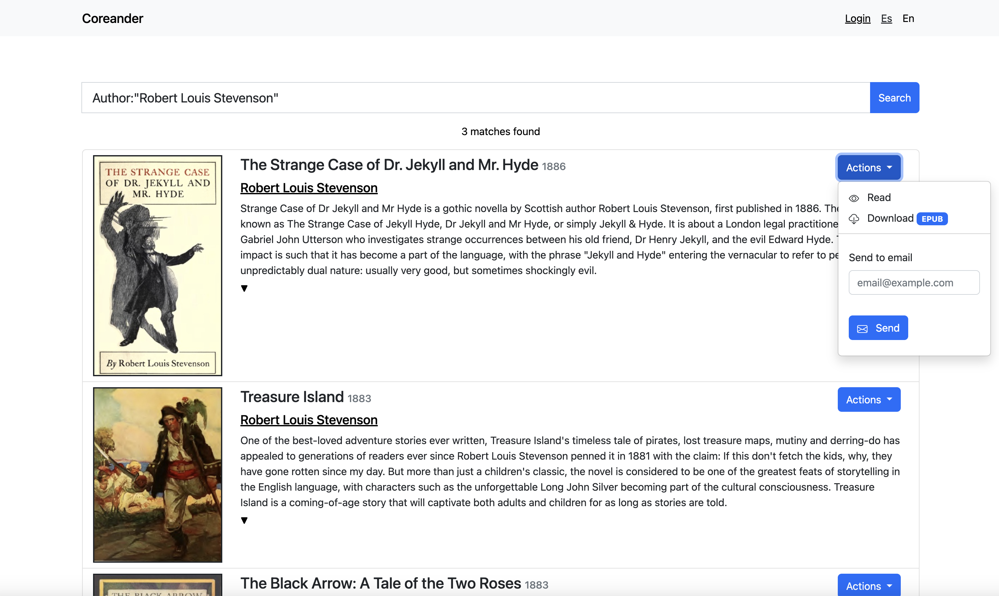

# Coreander
A personal Ebooks server for Linux, Coreander indexes the ebooks (only EPUBs with no DRM at the moment) that it finds in the passed folder, and provides a web interface to search and access them.



## Features
* Fast search engine powered by [Bleve](https://github.com/blevesearch/bleve), with support for ebooks in multiple languages.
* High-performance web server powered by [Fiber](https://github.com/gofiber/fiber).
* Lightweight, responsive web interface based on [Bootstrap](https://getbootstrap.com/).
* New books added or removed to/from the library folder are automatically indexed.

## Installation
Only source code is provided at the moment, so you'll have to manually build it. The only requirement is Go 1.15.

Clone the repo and, from its directory, run `go build` to generate the binary and then execute it with `coreander`. That's it. Note that if you want to move the generated binary to a different directory, both the `views` and `public` folders must be copied as well.

## How to use
Coreander is designed to be run as a service managed by systemd or any other service manager. For example, in Raspbian, just create a file called `/etc/systemd/system/coreander.service` with the following contents:

```
[Unit]
Description=coreander

[Service]
Type=simple
Restart=always
RestartSec=5s
WorkingDirectory=<absolute path to directory which contains coreander binary>
ExecStart=<absolute path to coreander binary>
PermissionsStartOnly=true
StandardOutput=syslog
StandardError=syslog
SyslogIdentifier=sleepservice
User=<user which will execute this service>
Environment="LIBPATH=<absolute path to the library>"

```

then, start the service with `service coreander start`. You can manage it with the usual commands `start`, `stop` and `status`. Refer to the your service manager documentation for more information.

Coreander requires a `LIBPATH` environment variable to be set, which tells the application where your books are located.

On first run, Coreander will index the books in your library, creating a database with those entries located at `$home/coreander/db`. Depending on your system's performance and the size of your library this may take a while. Also, the database can grow fairly big, so make sure you have enough free space on disk.

Even if the application is still indexing entries, you can access its web interface right away. Just open a web browser and go to `localhost:3000` (replace `localhost` for the IP address of the machine where the server is running if you want to access it from another machine). It is possible to change the listening port just executing the application with the `PORT` environment variable (e. g. `PORT=4000 coreander`) 