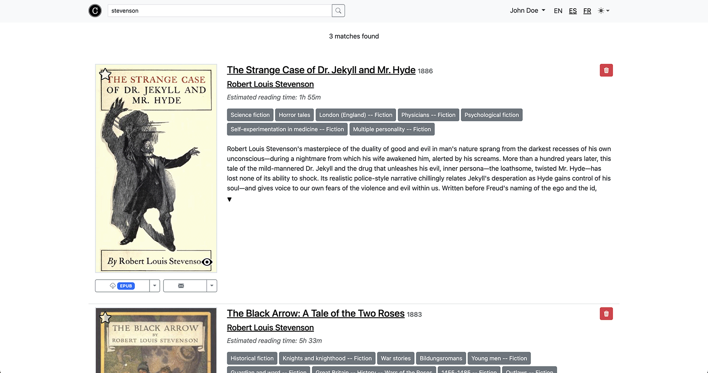

# 

A personal documents server, Coreander indexes the documents (EPUBs and PDFs with no DRM) that it finds in the passed folder, and provides a web interface to search and access them.


*Coreander home*

## Features
* Single binary with all dependencies included.
* Fast search engine powered by [Bleve](https://github.com/blevesearch/bleve), with support for documents in multiple languages.
* Search by author, title and even document series ([Calibre's](https://calibre-ebook.com/) `series` meta supported)
* Improved search for documents with metadata in english, spanish, french, italian, german and portuguese, including genre and singular/plural forms of words in the results among others.
* Estimated reading time calculation.
* High-performance web server powered by [Fiber](https://github.com/gofiber/fiber).
* Lightweight, responsive web interface based on [Bootstrap](https://getbootstrap.com/).
* Web interface available in english, spanish and french, more languages can be easily added.
* New documents added or removed to/from the library folder are automatically indexed (Linux only).
* [Send to email supported](#send-to-email).
* Read indexed epubs and PDFs from Coreander's interface thanks to [foliate-js](https://github.com/johnfactotum/foliate-js).
* Restrictable access only to registered users.
* Upload documents through the web interface.
* Download as kepub (epub for Kobo devices) converted on the fly thanks to [Kepubify](https://github.com/pgaskin/kepubify).
* Gather information about authors from [Wikidata](https://wikidata.org).

## Installation

Binaries for Windows 64 bit, Linux 32 and 64 bits for both X86 and ARM (Raspberry Pi and other SBCs) and Macs with Intel and Apple processors are available at [releases](https://github.com/svera/coreander/releases/latest). Just download and unzip the one appropriate for your system.

### Building from source
Coreander's only requirement is Go >= 1.24.1.

When cloning Coreander's repository, use Git's `--recurse-submodules` flag to also retrieve `foliate-js` contents as well, which is required for the reader component:

```
git clone git@github.com:svera/coreander.git --recurse-submodules
```

There are two possibilities for building Coreander from source:
* If you have [Mage](https://magefile.org) installed in your system, just type `mage install` from the source code folder.
* Otherwise, a simple `go build` or `go install` will do, although no version information will be added to the executable.

## How to use
Coreander is designed to be run as a service managed by [systemd](https://systemd.io) or any other service manager. For example, in Raspberry Pi OS, just create a file called `/etc/systemd/system/coreander.service` with the following contents:

```
[Unit]
Description=coreander

[Service]
Restart=always
RestartSec=5s
WorkingDirectory=<absolute path to directory which contains coreander binary>
ExecStart=<absolute path to coreander binary>
PermissionsStartOnly=true
SyslogIdentifier=sleepservice
User=<user which will execute this service>
Environment="LIB_PATH=<absolute path to the library>"

```

then, start the service with `service coreander start`. You can manage it with the usual commands `start`, `stop` and `status`. Refer to your service manager documentation for more information.

Coreander requires the absolute path where your documents are located as an argument. You can also pass it through the `LIB_PATH` environment variable.

On first run, Coreander will index the documents in your library, creating a database with those entries located at `$home/coreander/index`. Depending on your system's performance and the size of your library this may take a while. Also, the database can grow fairly big, so make sure you have enough free space on disk.

Every time is run, the application scans the library folder only for documents not yet indexed and adds them to the index. You can force to index all documents wether they were previously indexed or not by passing the `--force-indexing` flag or setting the environment variable `FORCE_INDEXING` to `true`.

Even if the application is still indexing entries, you can access its web interface right away. Just open a web browser and go to `localhost:3000` (replace `localhost` with the hostname / IP address of the machine where the server is running if you want to access it from another system). It is possible to change the listening port just executing the application with the `-p` or `--port` flags, or the `PORT` environment variable (e. g. `coreander -p 4000` or `PORT=4000 coreander`)

### Setting up an Internet-facing server

If you plan to set up Coreander in a public Internet server such as a VPS, using [Caddy](https://caddyserver.com/) as a reverse proxy is strongly recommended, as it is dead simple to set up and comes with several niceties such as HTTPS out of the box through [Let's Encrypt](https://letsencrypt.org/).

For example, if you have Coreander listening to port 3000 in your server and a domain called `coreander.example.com` that points to the IP address of your server, you can just tell Caddy to enroute requests to `coreander.example.com` to Coreander by putting this in Caddy's `Caddyfile`:

```
coreander.example.com {
    reverse_proxy :3000
}
```

Refer to [Caddy documentation](https://caddyserver.com/docs) for more information.

### Email

Some features rely on having an SMTP email service set up, and won't be available otherwise:

* Send document to email.
* Recover user password.

You can use any email service that allow sending emails using the SMTP protocol, like [GMX](https://gmx.com/mail). The following flags or environment variables need to be defined:

|Flag|Environment variable|Description|
|----|--------------------|-----------|
|`--smtp-server`  | `SMTP_SERVER`  | The URL of the SMTP server to be used, for example `mail.gmx.com`.|
|`--smtp-port`    | `SMTP_PORT`    | The port number used by the email service, defaults to `587`. |
|`--smtp-user`    | `SMTP_USER`    | The user name. |
|`--smtp-password`| `SMTP_PASSWORD`| User's password. |

#### Send to email

Coreander can send documents through email. This way, you can take advantage of services such as [Amazon's send to email](https://www.amazon.com/gp/help/customer/display.html?nodeId=G7NECT4B4ZWHQ8WV), which also automatically converts EPUB and other formats to the target device.

### User management and access restriction

Coreander distinguish between two kinds of users: regular users and administrator users, with the latter being the only ones with the ability to create new users and upload and delete documents.

By default, Coreander allow unrestricted access to its contents, except management areas which require an administrator user. To allow access only to registered users in the whole application, pass the `-a` or `--require-auth` flags, or the `REQUIRE_AUTH=true` environment variable.

On first run, Coreander creates an admin user with the following credentials:

* Email: `admin@example.com`
* Password: `admin`

> [!CAUTION]
> For security reasons, it is strongly encouraged to add a new admin and remove the default one as soon as possible.

### Settings

Run `coreander -h` or `coreander --help` to see help.

In case both a flag and its equivalent environment variable are passed, flag takes precendence.

|Flag|Environment variable|Description|
|----|--------------------|-----------|
|                                     |`LIB_PATH`                | Absolute path to the folder containing the documents.
|`-p` or `--port`                     |`PORT`                    | Port number in which the webserver listens for requests. Defaults to 3000.
|`-b` or `--batch-size`               |`BATCH_SIZE`              | Number of documents persisted by the indexer in one write operation. Defaults to 100.
|`--cover-max-width`                  |`COVER_MAX_WIDTH`         | Maximum horizontal size for documents cover thumbnails in pixels. Defaults to 600.
|`--author-image-max-width`           |`AUTHOR_IMAGE_MAX_WIDTH`  | Maximum horizontal size for author images in pixels. Set to 0 to keep original image size. Defaults to 600.
|`-c` or `--cache-dir`                |`CACHE_DIR`               | Directory where to store cache files. Defaults to `~/.coreander/cache`.
|`-f` or `--force-indexing`           |`FORCE_INDEXING`          | Whether to force indexing already indexed documents or not. Defaults to false.
|`--smtp-server`                      |`SMTP_SERVER`             | Address of the send mail server.
|`--smtp-port`                        |`SMTP_PORT`               | Port number of the send mail server. Defaults to 587.
|`--smtp-user`                        |`SMTP_USER`               | User to authenticate against the SMTP server.
|`--smtp-password`                    |`SMTP_PASSWORD`           | User's password to authenticate against the SMTP server.
|`-s` or `--jwt-secret`               |`JWT_SECRET`              | String to use to sign JWTs.
|`-a` or `--require-auth`             |`REQUIRE_AUTH`            | Require authentication to access the application if true. Defaults to false.
|`--min-password-length`              |`MIN_PASSWORD_LENGTH`     | Minimum length acceptable for passwords. Defaults to 5.
|`--words-per-minute`                 |`WORDS_PER_MINUTE`        | Defines a default words per minute reading speed that will be used for not logged-in users. Defaults to 250.
|`--session-timeout`                  |`SESSION_TIMEOUT`         | Specifies the maximum time a user session may last, in hours. Floating-point values are allowed. Defaults to 24 hours.
|`--recovery-timeout`                 |`RECOVERY_TIMEOUT`        | Specifies the maximum time a user recovery link may last, in hours. Floating-point values are allowed. Defaults to 2 hours.
|`-u` or `--upload-document-max-size` |`UPLOAD_DOCUMENT_MAX_SIZE`| Maximum document size allowed to be uploaded to the library, in megabytes. Set this to 0 to unlimit upload size. Defaults to 20 megabytes.
|`-d` or `--fqdn`                     |`FQDN`                    | Domain name of the server. If Coreander is listening to a non-standard HTTP / HTTPS port, include it using a colon (e. g. example.com:3000). Defaults to `localhost`.
|`-v` or `--version`                  |                          | Show version number.


## Screenshots


*Search results*

*Document detail in dark mode*

*Reading interface*
